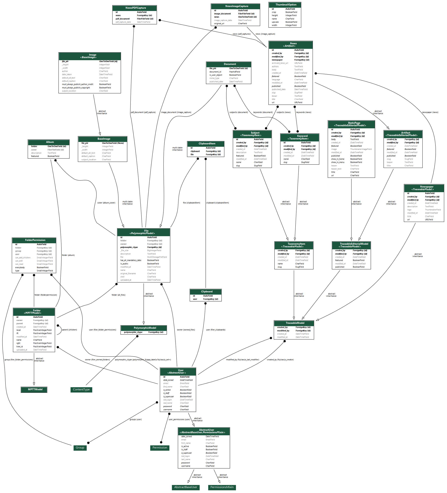

# Backend do site xRAM-Memory

Este projeto concentra o sistema gestor de conteúdo e a API para o site do xRAM-Memory. O projeto utilizou várias bibliotecas em Python, especialmente: Django (Framework base e CMS), Django REST Framework (API), newspaper3k e goose3 (crawlers de notícia), django-filer (Gestão de arquivos) e celery (Gestão de filas para processamento distribuído).

As dependências do projeto são geridas com a ferramenta `pipenv`.

## Entidades de dados

Os seguintes modelos (entidades) estão presentes neste projeto:

O diagrama abaixo ilustra a relação entre as entidades (clique para abrir a imagem):

[](./docs/entidades.png)

## Estrutura do projeto

Um projeto em Django é constituído de vários aplicativos, cada um com uma responsabilidade específica, o que pode ser expresso pela organização das pastas. Esta é a estrutura da pasta `./xram_memory`, que contém o código-fonte do sistema:

```
.
├── albums - Aplicativo para gestão de álbuns
├── artifact - Aplicativo para gestão de Artefatos
├── lib - Bibliotecas especializadas desenvolvidas para o projeto
│   ├── file_previews - Gerador de visualizações de arquivo
│   ├── news_fetcher - Programa principal do sistema, mais sobre ele abaixo
│   │   └── plugins - As diversas implementações de plugins
│   │       ├── archives - Arquivadores de Notícias
│   │       ├── parsers - Extratores de conteúdo de Notícias
│   │       └── pdf_captures - Geradores de capturas de notícia em PDF
│   └── stopwords - Um dicionário de stopwords em vários idiomas
├── logger - Aplicativo responsável por logar operações do sistema
├── lunr_index - Aplicativo responsável pela geração de índices de pesquisa client-side
├── page - Aplicativo para a gestão de Páginas Estáticas
├── quill_widget - Aplicativo que provê um widget para edição em texto rico com a biblioteca Quill.js
├── search_indexes - Aplicativo responsável pela geração de índices de pesquisa server-side (ElasticSearch)
├── static - Arquivos estáticos
├── taxonomy - Aplicativo responsável pela classificação do conteúdo (Taxonomia)
├── templates - Alterações globais em templates
├── users - Aplicativo responsável pela gestão de usuários e grupos
└── utils - Utilitários globais
```

Na pasta `./tests` temos os testes do projeto. Atualmente a cobertura do código está em 65%.